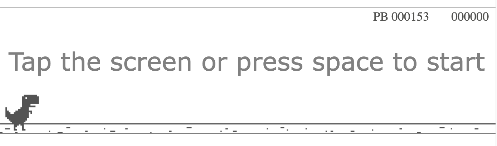

# DinoGame
Created following the ["Coding with Adam" Youtube tutorial](https://www.youtube.com/watch?v=ooru4pyEv1I) this game replicates the Chrome dino game found at chrome://dino

https://github.com/SophieOD1/DinoGame/assets/71010870/63865f68-2042-418f-9ccc-ded0f777ab11

---
## To run
- Install the VS code extension "Live Server" (https://marketplace.visualstudio.com/items?itemName=ritwickdey.LiveServer)
- Right click on the index.html file and select "Open with Live Server"

